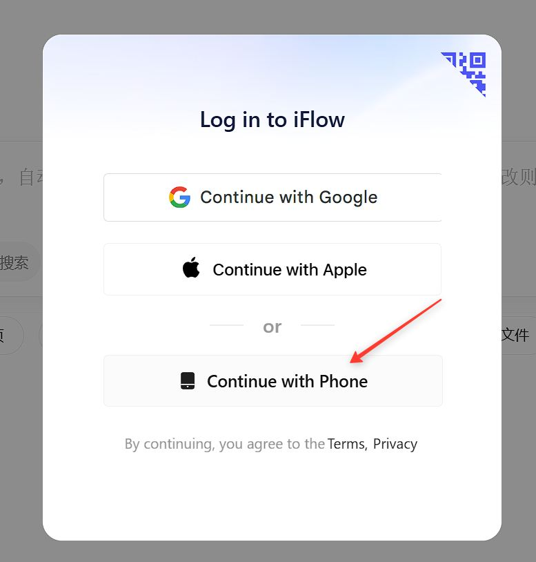
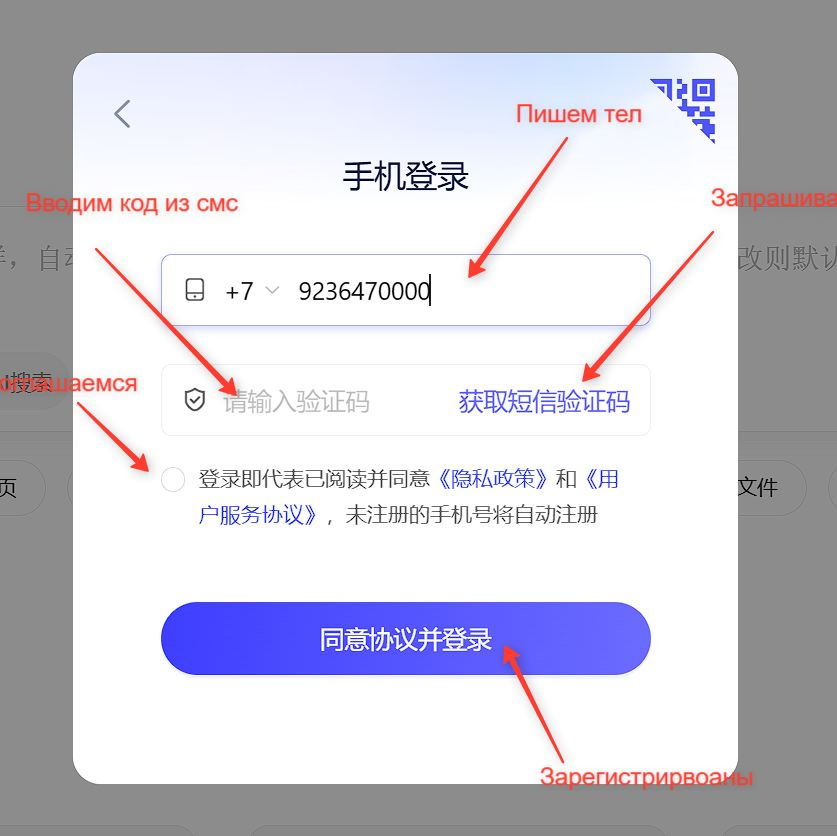

# iFlow Proxy Server

A simple proxy server written in Go that provides **completely free unlimited** access to GLM-5 and other models available in [iFlow CLI](https://iflow.cn) for your own purposes in a format compatible with OpenAI API.

> ⚠️ **WARNING: Use at your own risk!**
> The author is not responsible for the use of this software. You use it entirely at your own risk.

The proxy server uses authorization and endpoints from **iFlow CLI** to provide unlimited API requests to GLM-5 and other models in a format compatible with OpenAI API.

## 🎯 Available Models

| # | Model | Provider | Context Window | Input ($/1M) | Output ($/1M) | Note |
|---|--------|-----------|----------------|--------------|---------------|------|
| 1 | `glm-5` | iflow (Zhipu) | 200K | ~~$0.80~~ **FREE** | ~~$2.56~~ **FREE** | Flagship Zhipu |
| 2 | `qwen3-max` | iflow (Alibaba) | 256K | ~~$1.20~~ **FREE** | ~~$6.00~~ **FREE** | Market price (Intl) |
| 3 | `qwen3-max-preview` | iflow (Alibaba) | 256K | ~~$1.20~~ **FREE** | ~~$6.00~~ **FREE** | - |
| 4 | `qwen3-235b-thinking` | iflow (Alibaba) | 131K | ~~$0.26~~ **FREE** | ~~$0.90~~ **FREE** | 235B series |
| 5 | `deepseek-v3.2` | iflow (DeepSeek) | 128K | ~~$0.28~~ **FREE** | ~~$0.42~~ **FREE** | - |
| 6 | `deepseek-r1` | iflow (DeepSeek) | 128K | ~~$0.55~~ **FREE** | ~~$2.19~~ **FREE** | - |
| 7 | `qwen3-235b-instruct` | iflow (Alibaba) | 128K | ~~$0.21~~ **FREE** | ~~$1.09~~ **FREE** | - |
| 8 | `qwen3-235b` | iflow (Alibaba) | 128K | ~~$0.21~~ **FREE** | ~~$1.09~~ **FREE** | - |
| 9 | `kimi-k2-thinking` | moonshot | 131K | ~~$0.47~~ **FREE** | ~~$2.00~~ **FREE** | Lower price |
| 10 | `kimi-k2.5` | moonshot | 256K | ~~$0.45~~ **FREE** | ~~$2.20~~ **FREE** | Latest Kimi |
| 11 | `qwen3-coder-plus` | iflow (Alibaba) | 1024K | ~~$1.00~~ **FREE** | ~~$5.00~~ **FREE** | Long Context |
| 12 | `deepseek-v3` | iflow (DeepSeek) | 128K | ~~$0.28~~ **FREE** | ~~$0.88~~ **FREE** | - |
| 13 | `kimi-k2` | iflow (Moonshot) | 256K | ~~$0.60~~ **FREE** | ~~$2.50~~ **FREE** | Standard Tier |
| 14 | `kimi-k2-0905` | iflow (Moonshot) | 256K | ~~$0.60~~ **FREE** | ~~$2.50~~ **FREE** | - |
| 15 | `glm-4.7` | iflow (Zhipu) | 200K | ~~$0.06~~ **FREE** | ~~$0.40~~ **FREE** | Cheapest |
| 16 | `qwen3-32b` | iflow (Alibaba) | 256K | ~~$0.08~~ **FREE** | ~~$0.24~~ **FREE** | - |
| 17 | `minimax-m2.5` | minimax | 200K | ~~$0.30~~ **FREE** | ~~$1.20~~ **FREE** | - |
| 18 | `qwen3-vl-plus` | iflow (Alibaba) | 128K | ~~$0.53~~ **FREE** | ~~$2.66~~ **FREE** | Vision model |
| 19 | `iflow-rome-30ba3b` | iflow | 131K | ~~$0.00~~ **FREE** | ~~$0.00~~ **FREE** | Free (iflow quota) |

> 💡 **All models are completely free and unlimited through this proxy!**

## ⚠️ Important Limitations

- **Works only on Windows** - currently the proxy server is configured to work only on Windows operating system
- On Mac and Linux, the paths to CLI key files may differ. If desired, you can investigate and extend the source code to support these operating systems

## 🔧 Editing Source Code

If you want to change settings (ports, paths, etc.):

1. Make sure **Go** is installed on your computer
2. Edit the [`main.go`](main.go) file as needed
3. Run the [`rebuild-and-start.bat`](rebuild-and-start.bat) file
   - It will automatically find and stop the running process
   - Recompile the program
   - Start the proxy server with new settings

## Features

- ✅ OpenAI-compatible API (`/v1/chat/completions` format)
- ✅ Unlimited requests to models including GLM5 via iFlow CLI
- ✅ Streaming support
- ✅ Automatic authorization via iFlow CLI settings (installed on your PC)
- ✅ CORS support for web applications

## 📖 Step-by-Step Guide

### Step 1: Register on iflow.cn

1. Go to [iflow.cn](https://iflow.cn)
2. Click the registration button





3. Follow the instructions to create an account

### Step 2: Install iFlow CLI

Open a terminal (PowerShell or CMD) and run:

```bash
npm i -g @iflow-ai/iflow-cli
```

### Step 3: Authorize in iFlow CLI

Run the CLI with the command:

```bash
iflow
```

Follow the instructions to authorize via the website.

### Step 4: Start the Proxy Server

Two options are available to start the proxy server:

**Option 1: Quick Start (without recompilation)**
```bash
start.bat
```
This file kills the old process and starts the already compiled `iflow-proxy.exe`.

**Option 2: Recompile and Start**
```bash
rebuild-and-start.bat
```
This file recompiles the program and starts it.

The proxy server will start at: **http://127.0.0.1:8318**

### Step 5: Configure Kilo Code


1. Open Kilo Code settings
2. In the **API Endpoint** field, specify:
   ```
   http://127.0.0.1:8318/v1
   ```
3. In the **API Token** field, enter **any value** (e.g., `dummy-token`)
   - The token is not verified by the proxy server, authorization occurs via iFlow CLI
4. Select a model: `glm-5` or any other from the supported list

## API Endpoints

### Get List of Models

```bash
GET http://127.0.0.1:8318/v1/models
```

**Example curl request:**
```bash
curl http://localhost:8318/v1/models
```

### Chat Completions (OpenAI-compatible)

```bash
POST http://127.0.0.1:8318/v1/chat/completions
```

**Example curl request:**
```bash
curl http://localhost:8318/v1/chat/completions \
  -H "Content-Type: application/json" \
  -d '{
    "model": "glm-4.7",
    "messages": [{"role": "user", "content": "Hello!"}],
    "stream": false
  }'
```

**Example JSON request:**
```json
{
  "model": "glm-5",
  "messages": [
    {
      "role": "user",
      "content": "Hello! How are you?"
    }
  ],
  "stream": true
}
```

## How It Works

1. The proxy server automatically reads the API key from `~/.iflow/settings.json`
2. Upon receiving a request, it forms an HMAC-SHA256 signature for authorization in iFlow
3. Forwards the request to iFlow API without modifying the content
4. Returns the response in a format compatible with OpenAI API

## Logging

All requests and responses are logged to the `proxy.log` file in the proxy server startup directory.

## Requirements

- **Windows** operating system
- Installed iFlow CLI with active authorization
- Go 1.21+ (only for editing and recompiling source code)

## Ports

- **8318** - default proxy server port

## Troubleshooting

### Error "API key: read config: no such file or directory"

Make sure iFlow CLI is installed and you are authorized:
```bash
iflow login
```

### Error "API key empty"

Check that the file `~/.iflow/settings.json` contains a valid API key.

### Port Already in Use

Change the port in the `main.go` file (constant `PROXY_PORT`).

## License

MIT License

---

**Русская версия:** [README_RU.md](README_RU.md)