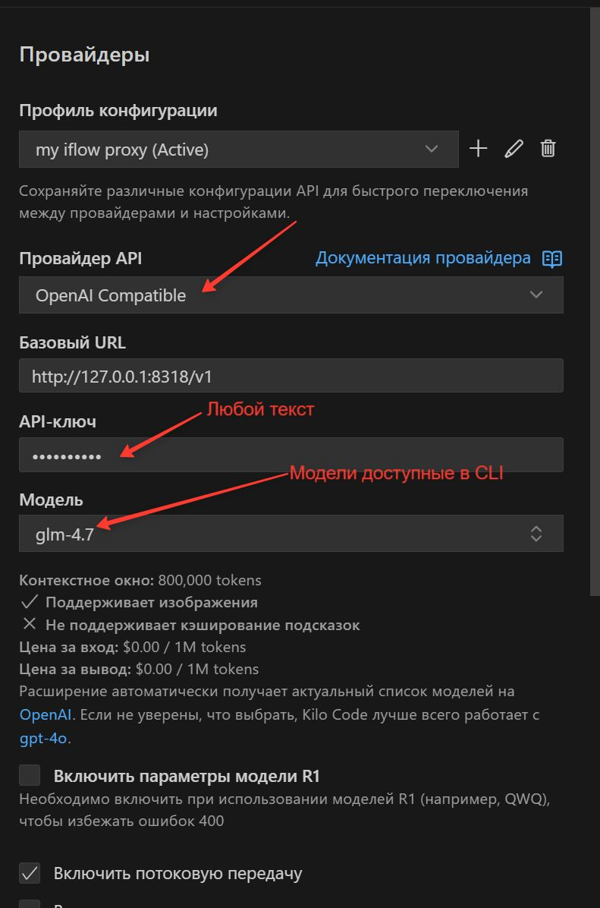

# iFlow Proxy Server

Простейший прокси-сервер, написанный на Go, позволяющий получить **полностью бесплатный безлимитный** доступ к GLM-5 и другим моделям, доступным в [iFlow CLI](https://iflow.cn), для ваших собственных целей в формате, совместимом с OpenAI API.

> ⚠️ **ВНИМАНИЕ: Используйте на свой страх и риск!**
> Автор не несет ответственности за применение данного программного обеспечения. Вы используете его исключительно под свою ответственность.

Прокси-сервер использует авторизацию и эндпоинты из **iFlow CLI** для предоставления безлимитных API запросов к моделям GLM-5 и другим в формате, совместимом с OpenAI API.

## 🎯 Доступные модели

| # | Модель | Провайдер | Context Window | Input ($/1M) | Output ($/1M) | Примечание |
|---|--------|-----------|----------------|--------------|---------------|------|
| 1 | `glm-5` | iflow (Zhipu) | 200K | ~~$0.80~~ **FREE** | ~~$2.56~~ **FREE** | Флагман Zhipu |
| 2 | `qwen3-max` | iflow (Alibaba) | 256K | ~~$1.20~~ **FREE** | ~~$6.00~~ **FREE** | Рыночная цена (Intl) |
| 3 | `qwen3-max-preview` | iflow (Alibaba) | 256K | ~~$1.20~~ **FREE** | ~~$6.00~~ **FREE** | - |
| 4 | `qwen3-235b-thinking` | iflow (Alibaba) | 131K | ~~$0.26~~ **FREE** | ~~$0.90~~ **FREE** | 235B серия |
| 5 | `deepseek-v3.2` | iflow (DeepSeek) | 128K | ~~$0.28~~ **FREE** | ~~$0.42~~ **FREE** | - |
| 6 | `deepseek-r1` | iflow (DeepSeek) | 128K | ~~$0.55~~ **FREE** | ~~$2.19~~ **FREE** | - |
| 7 | `qwen3-235b-instruct` | iflow (Alibaba) | 128K | ~~$0.21~~ **FREE** | ~~$1.09~~ **FREE** | - |
| 8 | `qwen3-235b` | iflow (Alibaba) | 128K | ~~$0.21~~ **FREE** | ~~$1.09~~ **FREE** | - |
| 9 | `kimi-k2-thinking` | moonshot | 131K | ~~$0.47~~ **FREE** | ~~$2.00~~ **FREE** | Сниженная цена |
| 10 | `kimi-k2.5` | moonshot | 256K | ~~$0.45~~ **FREE** | ~~$2.20~~ **FREE** | Последняя Kimi |
| 11 | `qwen3-coder-plus` | iflow (Alibaba) | 1024K | ~~$1.00~~ **FREE** | ~~$5.00~~ **FREE** | Long Context |
| 12 | `deepseek-v3` | iflow (DeepSeek) | 128K | ~~$0.28~~ **FREE** | ~~$0.88~~ **FREE** | - |
| 13 | `kimi-k2` | iflow (Moonshot) | 256K | ~~$0.60~~ **FREE** | ~~$2.50~~ **FREE** | Стандартный Tier |
| 14 | `kimi-k2-0905` | iflow (Moonshot) | 256K | ~~$0.60~~ **FREE** | ~~$2.50~~ **FREE** | - |
| 15 | `glm-4.7` | iflow (Zhipu) | 200K | ~~$0.06~~ **FREE** | ~~$0.40~~ **FREE** | Самая дешёвая |
| 16 | `qwen3-32b` | iflow (Alibaba) | 256K | ~~$0.08~~ **FREE** | ~~$0.24~~ **FREE** | - |
| 17 | `minimax-m2.5` | minimax | 200K | ~~$0.30~~ **FREE** | ~~$1.20~~ **FREE** | - |
| 18 | `qwen3-vl-plus` | iflow (Alibaba) | 128K | ~~$0.53~~ **FREE** | ~~$2.66~~ **FREE** | Vision модель |
| 19 | `iflow-rome-30ba3b` | iflow | 131K | ~~$0.00~~ **FREE** | ~~$0.00~~ **FREE** | Бесплатно (квота iflow) |

> 💡 **Все модели полностью бесплатны и безлимитны через данный прокси!**

## ⚠️ Важные ограничения

- **Работает только на Windows** - на данный момент прокси-сервер настроен для работы только в операционной системе Windows
- На Mac и Linux пути к файлам с ключами от CLI могут отличаться. При желании можно разобраться и дополнить исходный код для поддержки этих ОС

## 🔧 Редактирование исходного кода

Если вы хотите изменить настройки (порты, пути и т.п.):

1. Убедитесь, что на компьютере установлен **Go**
2. Отредактируйте файл [`main.go`](main.go) по своему усмотрению
3. Запустите файл [`rebuild-and-start.bat`](rebuild-and-start.bat)
   - Он автоматически найдёт и остановит запущенный процесс
   - Перекомпилирует программу
   - Запустит прокси-сервер с новыми настройками

## Возможности

- ✅ OpenAI-совместимый API (формат `/v1/chat/completions`)
- ✅ Безлимитные запросы к моделям включая GLM5 через iFlow CLI
- ✅ Поддержка стриминга (streaming responses)
- ✅ Автоматическая авторизация через настройки iFlow CLI (установленном на вашем пк)
- ✅ CORS поддержка для веб-приложений

## Установка и настройка для Kilo Code

### Шаг 1: Установка iFlow CLI

Скачайте и установите iFlow CLI с официального сайта: https://iflow.cn

### Шаг 2: Авторизация в iFlow CLI

Откройте терминал и выполните команду авторизации:

```bash
iflow login
```

Следуйте инструкциям для входа в ваш аккаунт iFlow.

### Шаг 3: Запуск прокси-сервера

Для запуска прокси-сервера доступны два варианта:

**Вариант 1: Быстрый запуск (без перекомпиляции)**
```bash
start.bat
```
Этот файл убивает старый процесс и запускает уже скомпилированный `iflow-proxy.exe`.

**Вариант 2: Перекомпиляция и запуск**
```bash
rebuild-and-start.bat
```
Этот файл перекомпилирует программу и запустит её.

Прокси-сервер запустится на адресе: **http://127.0.0.1:8318**

### Шаг 4: Настройка Kilo Code



1. Откройте настройки Kilo Code
2. В поле **API Endpoint** укажите:
   ```
   http://127.0.0.1:8318/v1
   ```
3. В поле **API Token** введите **любое значение** (например: `dummy-token`)
   - Токен не проверяется прокси-сервером, авторизация происходит через iFlow CLI
4. Выберите модель: `glm-5` или любую другую из списка поддерживаемых

## API Эндпоинты

### Получение списка моделей

```bash
GET http://127.0.0.1:8318/v1/models
```

**Пример curl запроса:**
```bash
curl http://localhost:8318/v1/models
```

### Чат-комплит (OpenAI-совместимый)

```bash
POST http://127.0.0.1:8318/v1/chat/completions
```

**Пример curl запроса:**
```bash
curl http://localhost:8318/v1/chat/completions \
  -H "Content-Type: application/json" \
  -d '{
    "model": "glm-4.7",
    "messages": [{"role": "user", "content": "Привет!"}],
    "stream": false
  }'
```

**Пример JSON запроса:**
```json
{
  "model": "glm-5",
  "messages": [
    {
      "role": "user",
      "content": "Привет! Как дела?"
    }
  ],
  "stream": true
}
```

## Как это работает

1. Прокси-сервер автоматически считывает API ключ из `~/.iflow/settings.json`
2. При получении запроса формирует подпись HMAC-SHA256 для авторизации в iFlow
3. Пробрасывает запрос к iFlow API без модификации содержимого
4. Возвращает ответ в формате, совместимом с OpenAI API

## Логирование

Все запросы и ответы логируются в файл `proxy.log` в директории запуска прокси-сервера.

## Требования

- **Windows** операционная система
- Установленный iFlow CLI с активной авторизацией
- Go 1.21+ (только для редактирования и перекомпиляции исходного кода)

## Порты

- **8318** - порт прокси-сервера по умолчанию

## Troubleshooting

### Ошибка "API key: read config: no such file or directory"

Убедитесь, что iFlow CLI установлен и вы авторизованы:
```bash
iflow login
```

### Ошибка "API key empty"

Проверьте, что файл `~/.iflow/settings.json` содержит валидный API ключ.

### Порт уже занят

Измените порт в файле `main.go` (константа `PROXY_PORT`).

## Лицензия

MIT License